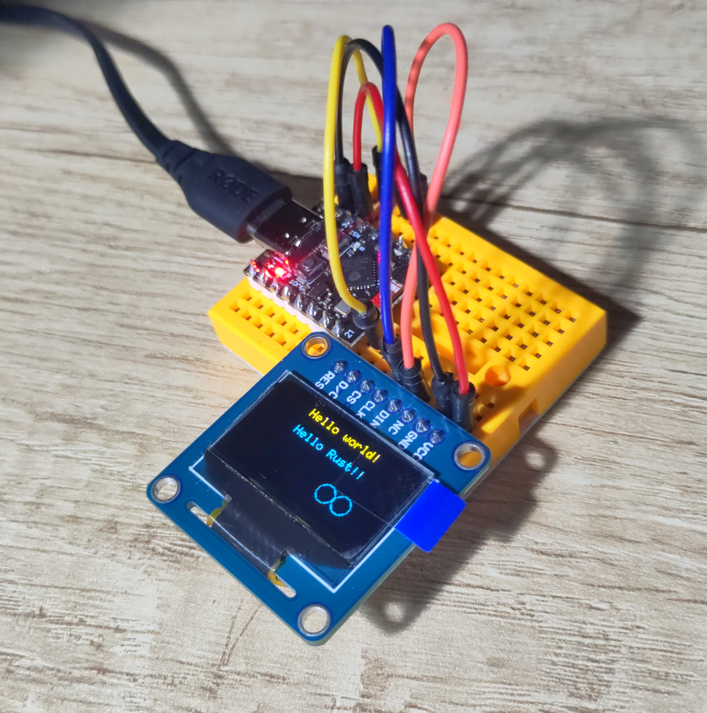
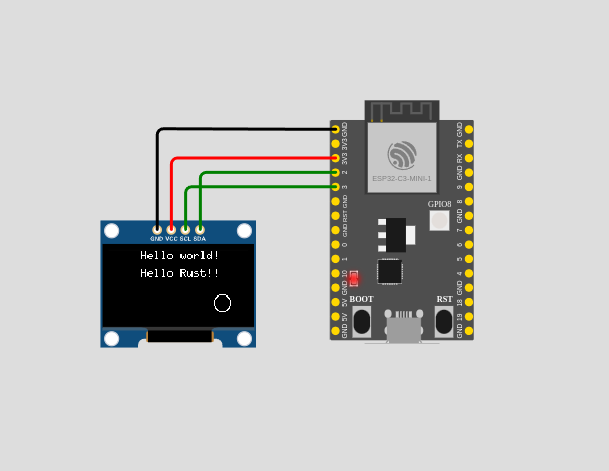

## Learning how to program `esp32c3` with Rust & IDF bindings

Using this little clone with a Waveshare OLED display (ssd1306 driver) in SPI mode. Note you need to solder a BS1 jumper on this guy in order to use the I2C mode.

- Generated from https://github.com/esp-rs/esp-idf-template
- WiFi "library" borrowed from https://github.com/esp-rs/std-training/tree/main/common/lib/wifi

